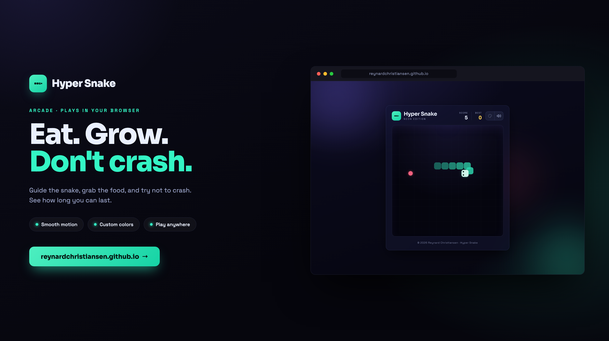
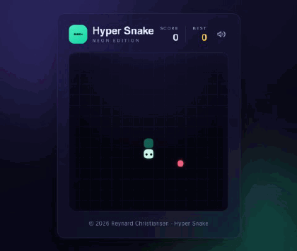

  

# Hyper Snake

The classic Snake game, rebuilt with vanilla HTML, CSS, and JavaScript.
Runs in the browser, works with keyboard or touch.

  <a href="https://reynardchristiansen.github.io/">🎮 Play it live</a> ·
  <a href="assets/hyper-snake.mp4">▶ Watch the MP4</a>

## Gameplay

  

## Features

- Smooth, interpolated snake movement
- Keyboard, touch D-pad, and swipe controls
- High score saved locally
- Sound effects with a mute toggle

## Controls

| Action | Desktop | Mobile |
|--------|---------|--------|
| Move   | `↑ ↓ ← →` or `W A S D` | Retro D-pad or swipe |
| Pause / Resume | `Space` | — |
| Start / Restart | **Play / Play Again** button | tap **Play / Play Again** |

## Objective

Eat the glowing food to grow longer. Avoid the walls and your own body.
Fill the entire **15 × 15** board (225 cells) to win!

## How to Play

Play online: **https://reynardchristiansen.github.io/**

Or run locally — just open `index.html` in any modern browser.

## Feedback

Reach out at reynard.satria@gmail.com

---

© 2026 Reynard Christiansen · Hyper Snake
